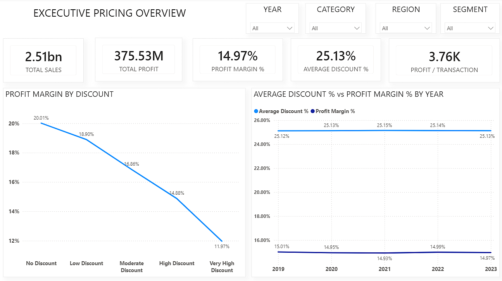
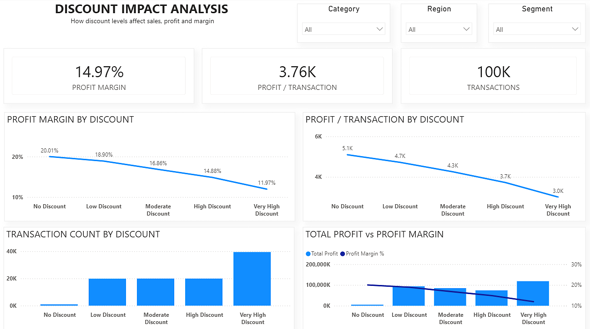
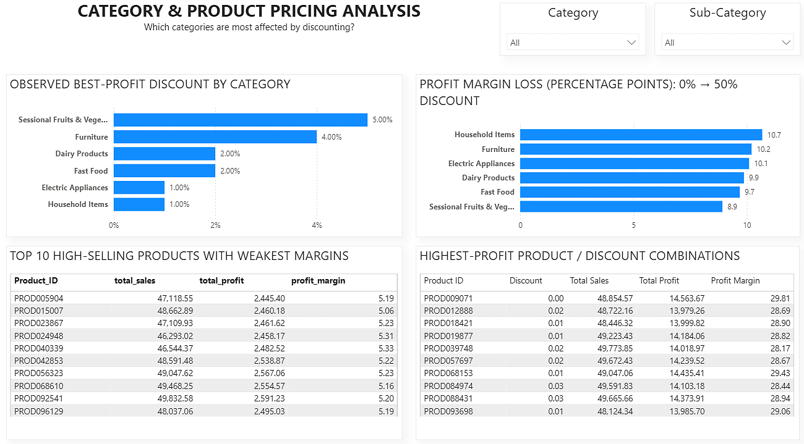
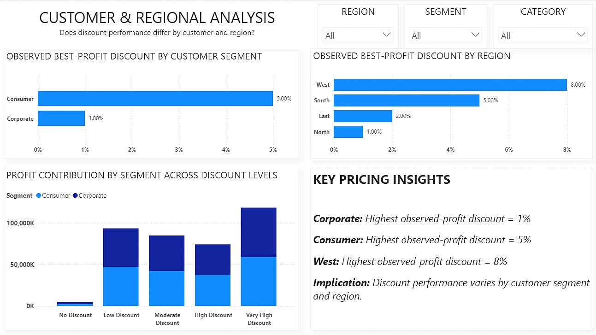
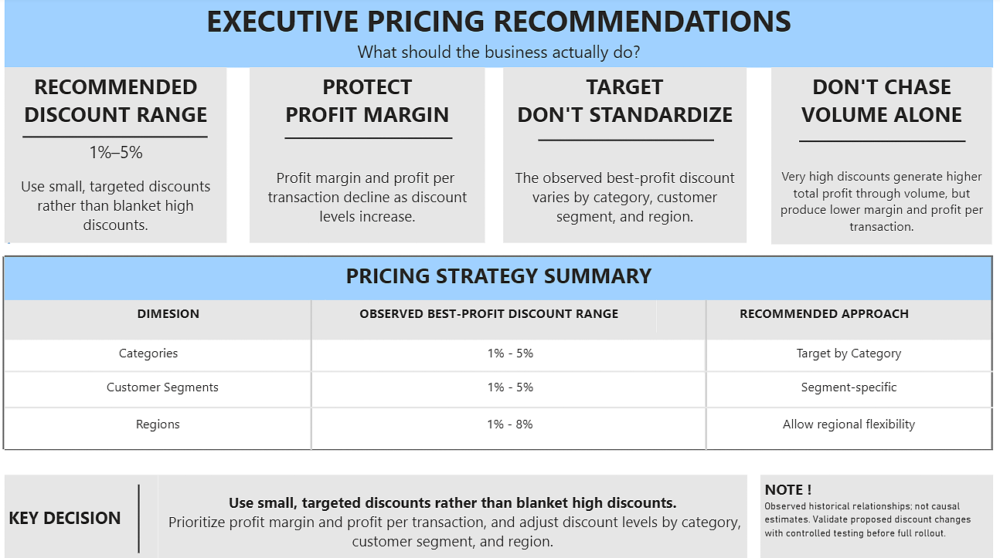

# Pricing & Discount Impact Analysis

## Business Context

This project analyzes how discounting affects sales, transaction volume, total profit, profit per transaction, and profit margin in a retail business.

The objective is not simply to find the discount that generates the highest sales or total profit. It is to understand the trade-off between **volume and profitability** and identify where discounts should be targeted rather than applied broadly.

## Tools Used

- **PostgreSQL / SQL** — business analysis, aggregation, ranking, CTEs, window functions, and profitability analysis
- **Power BI** — dashboard development and executive reporting
- **DAX** — KPI measures and analytical calculations
- **Power Query** — data preparation and transformation

## Project Structure

```text
Pricing-Discount-Impact-Analysis/
│
├── Pricing & Discount Impact Analysis.pbix
├── sql/
│   └── pricing_discount_impact_analysis.sql
├── screenshots/
│   ├── executive-pricing-overview.png
│   ├── discount-impact-analysis.png
│   ├── category-product-pricing-analysis.png
│   ├── customer-regional-analysis.png
│   └── executive-pricing-recommendations.png
├── README.md
└── LICENSE
```

## Executive KPI Snapshot

| KPI | Value |
|---|---:|
| Total Sales | 2.51B |
| Total Profit | 375.53M |
| Profit Margin | 14.97% |
| Average Discount | 25.13% |
| Profit / Transaction | 3.76K |

## Dashboard

The Power BI report contains five pages designed to move from overall performance to detailed pricing decisions.

### 1. Executive Pricing Overview

Provides the high-level business view using Total Sales, Total Profit, Profit Margin %, Average Discount %, Profit per Transaction, Profit Margin by Discount Bucket, and Average Discount % vs Profit Margin % by Year.

### 2. Discount Impact Analysis

Examines how increasing discounts affect profit margin, profit per transaction, transaction count, and total profit.

### 3. Category & Product Pricing Analysis

Drills into pricing behavior by category and product, including observed best-profit discount by category, profit margin loss from 0% to 50% discount, high-selling products with weak margins, and high-profit product/discount combinations.

### 4. Customer & Regional Analysis

Tests whether discount performance differs by customer segment and geography.

| Dimension | Observed best-profit discount |
|---|---:|
| Consumer | 5% |
| Corporate | 1% |
| North | 1% |
| East | 2% |
| South | 5% |
| West | 8% |

### 5. Executive Pricing Recommendations

Translates the analysis into an actionable pricing strategy: use small targeted discounts, allow category/segment/regional flexibility, and prioritize margin and profit per transaction over total profit alone.

## Dashboard Preview

### Executive Pricing Overview



### Discount Impact Analysis



### Category & Product Pricing Analysis



### Customer & Regional Analysis



### Executive Pricing Recommendations



## Key Findings

### 1. Discounting creates a clear margin trade-off

Profit margin declines as discount levels increase.

### 2. Total profit can be misleading

Very high discounts can produce higher total profit through transaction volume while still producing lower margin and profit per transaction.

### 3. Discount sensitivity is category-specific

The observed loss in profit margin from 0% to 50% discount differs by category, ranging from approximately **8.9 to 10.7 percentage points**.

### 4. Small discounts are more defensible than blanket high discounts

The analysis supports using targeted lower discounts rather than applying aggressive discounts broadly.

### 5. Discount performance varies by customer and region

The historical data does not support one universal discount level across all customer segments and regions.

## SQL Analysis

The `sql/pricing_discount_impact_analysis.sql` file contains the analysis used to investigate discount vs profit margin, sales and profit, profit per transaction, transaction changes, category-level discount profitability, product performance, segment behavior, regional behavior, and year-level trends.

Key SQL techniques include `RANK()`, `ROW_NUMBER()`, `NTILE()`, `LAG()`, CTEs, aggregation, conditional bucketing, and profitability calculations.

## Business Recommendation

> **Use small, targeted discounts rather than blanket high discounts. Prioritize margin and profit per transaction over total profit alone.**

The analysis is **observational, not causal**. Controlled experiments or A/B tests would be required before making causal pricing decisions or rolling out discount changes at scale.

## Author

**Rai-da**  
Data Analytics / Business Intelligence Portfolio Project
